# Architecture and protocol evidence

## Runtime structure

```mermaid
flowchart LR
  Client["SFTP client"] --> SFTP["localhost SSH/SFTP server"]
  SFTP --> Confine["path confinement and handle table"]
  Confine --> FS["remoteFilesystem client"]
  FS --> IPC["VS Code IPC serialization"]
  IPC --> Persistent["13-byte persistent framing"]
  Persistent --> WS["authenticated code-server WebSocket"]
  WS --> Agent["VS Code remote agent"]
  Agent --> Disk["remote disk filesystem provider"]
```

Focused modules implement each boundary:

| Responsibility | Module |
| --- | --- |
| CLI, secure secret loading, bind policy | `src/config.ts` |
| code-server login and in-memory cookies | `src/auth/codeServerAuth.ts` |
| RFC 6455 transport and backpressure | `src/transport/webSocketTransport.ts` |
| persistent remote-agent framing | `src/vscode/persistentProtocol.ts` |
| IPC value serialization and calls | `src/vscode/serialization.ts`, `src/vscode/ipcClient.ts` |
| handshake and management-channel context | `src/vscode/handshake.ts` |
| allowed `remoteFilesystem` RPC surface | `src/vscode/remoteFileSystem.ts` |
| lexical and symlink confinement | `src/confinement/pathConfinement.ts` |
| SFTP request handling and status mapping | `src/sftp/` |
| compatibility values | `src/compatibility/profiles.ts` |

## Source authority

The code-server authority is tag `v4.20.1`, commit
`e76afa4a2bf4667a3c9f71bf56ef34b8ad365fbe`. Its `lib/vscode` gitlink pins VS
Code commit `8b3775030ed1a69b13e4f4c628c612102e30a681` (VS Code 1.85.2).

| Decision | Exact upstream evidence |
| --- | --- |
| Login POST, failure-as-200, session cookie issuance | code-server `src/node/routes/login.ts` |
| Cookie name, validation, prefix-aware cookie path, origin checks | code-server `src/common/http.ts`, `src/node/http.ts` |
| WebSocket wrapper authentication and `without-connection-token` | code-server `src/node/routes/vscode.ts` |
| Browser path-prefix WebSocket construction | code-server `patches/base-path.diff` |
| `stable` quality and code-server commit embedded as product commit | code-server `ci/build/build-vscode.sh` |
| Remote-agent path and two-stage handshake | VS Code `src/vs/platform/remote/common/remoteHosts.ts`, `remoteAgentConnection.ts` |
| Server handshake checks and management connection | VS Code `src/vs/server/node/remoteExtensionHostAgentServer.ts` |
| 13-byte persistent header, ACK, replay, pause, keepalive | VS Code `src/vs/base/parts/ipc/common/ipc.net.ts` |
| IPC type tags, initialization, request/response headers | VS Code `src/vs/base/parts/ipc/common/ipc.ts` |
| Channel registration | VS Code `src/vs/server/node/serverServices.ts` |
| Command dispatch and signatures | VS Code `src/vs/platform/files/node/diskFileSystemProviderServer.ts` |
| `open`, `stat`, readdir, symlink, and error behavior | VS Code `src/vs/platform/files/node/diskFileSystemProvider.ts` |
| `vscode-remote` to `file` URI transformation | VS Code `src/vs/workbench/api/node/uriTransformer.ts` |

The reproducible checkout script verifies all three identities. Links to the
source snapshots are available in [THIRD_PARTY_NOTICES.md](../THIRD_PARTY_NOTICES.md).

## Authentication and route construction

1. GET the configured public URL and follow relative redirects to `/login`.
2. Parse the login form's `base`; POST `password`, `base`, and the final public
   login `href` as URL-encoded form data.
3. Reject a non-redirect response because incorrect passwords render HTTP 200.
4. Store `code-server-session` only in an in-memory cookie jar and verify it by
   fetching the public root.
5. Fetch `<base>/version` and compare the response to the profile product
   commit.
6. Connect to
   `<base>/stable-<productCommit>?reconnectionToken=<uuid>&reconnection=false&skipWebSocketFrames=false`.

The public product commit is the code-server commit, not the VS Code submodule
commit. This is a build-pipeline decision and is required both in the URL and
the handshake.

## Framing, handshake, and IPC

Persistent frames are `type:u8`, `id:u32be`, `ack:u32be`,
`payloadLength:u32be`, then payload. The implementation treats WebSocket
messages as arbitrary chunks because one frame can be split or multiple frames
can be coalesced.

The bridge sends an `auth` control message with the no-token fallback, echoes
the OSS sign challenge in a `connectionType` control message, selects
Management (`1`), and waits for `ok`. It then sends the official renderer
context `{remoteAuthority, clientId:"renderer"}`, exchanges IPC Initialize
messages, and restricts calls to channel `remoteFilesystem`.

IPC data tags and variable-length integer handling match the pinned source.
Buffers sent to write are explicitly tagged as VSBuffer (`3`); offsets outside
signed int32 are JSON-number values (`5`), as upstream requires.

## Files and write semantics

Native remote descriptors are used for serialized, offset-based reads. The
pinned provider's `open({create:true})` always maps to Node flag `w`, so it
cannot represent non-truncating SFTP write handles. Write-capable SFTP handles
therefore use a protected local staged file:

1. Download the existing file when SFTP flags require preservation.
2. Apply offset writes, append, reads, and truncate to the 0600 staged file.
3. On close, re-run confinement checks.
4. Stream to an unpredictable temporary file in the remote destination
   directory.
5. Re-check confinement/type and rename the temporary file over the original.

This also supplies backpressure, partial-write handling, and prevents a failed
upload from exposing partially rewritten target content.

## Connection loss

Every handle records a remote connection generation. A transport close rejects
pending IPC calls, invalidates existing handles, aborts local staged files, and
allows later stateless SFTP requests/new sessions to establish a fresh
management connection. Mutations are never blindly replayed after an uncertain
disconnect.
