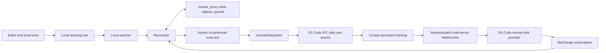

# Architecture and protocol evidence

## Runtime structure



| Responsibility | Module |
| --- | --- |
| Command definitions and project discovery | `src/cli.ts`, `src/projectConfig.ts` |
| Command implementations/runtime assembly | `src/commands/` |
| Safe interactive command parsing and dispatch | `src/shell/`, `src/commands/shell.ts` |
| Hidden prompt and protected password files | `src/secrets.ts` |
| code-server login and in-memory cookies | `src/auth/codeServerAuth.ts` |
| WebSocket and persistent framing | `src/transport/`, `src/vscode/persistentProtocol.ts` |
| IPC serialization, calls, and events | `src/vscode/serialization.ts`, `src/vscode/ipcClient.ts` |
| Remote-agent handshake | `src/vscode/handshake.ts` |
| Restricted remote filesystem API | `src/vscode/remoteFileSystem.ts` |
| Local/remote trees and path confinement | `src/sync/localTree.ts`, `remoteTree.ts`, `paths.ts` |
| Reconciliation and durable state | `src/sync/syncEngine.ts`, `stateStore.ts`, `objectStore.ts` |
| Watch coalescing/reconnect | `src/sync/watchers.ts`, `syncDaemon.ts` |
| Git safety snapshots | `src/git/checkpoints.ts` |
| Compatibility identities | `src/compatibility/profiles.ts` |

## Source authority

The code-server authority is tag `v4.20.1`, commit
`e76afa4a2bf4667a3c9f71bf56ef34b8ad365fbe`. Its `lib/vscode` gitlink pins VS
Code commit `8b3775030ed1a69b13e4f4c628c612102e30a681` (VS Code 1.85.2).

| Decision | Exact upstream evidence |
| --- | --- |
| Login POST, failure-as-200, cookie issuance | code-server `src/node/routes/login.ts` |
| Cookie validation/path and origin | code-server `src/common/http.ts`, `src/node/http.ts` |
| Authenticated VS Code WebSocket wrapper | code-server `src/node/routes/vscode.ts` |
| Prefix-aware route construction | code-server `patches/base-path.diff` |
| Stable quality/product commit | code-server `ci/build/build-vscode.sh` |
| Remote-agent client handshake | VS Code `src/vs/platform/remote/common/remoteAgentConnection.ts` |
| Server handshake and connection type | VS Code `src/vs/server/node/remoteExtensionHostAgentServer.ts` |
| Persistent header/ACK/replay/pause | VS Code `src/vs/base/parts/ipc/common/ipc.net.ts` |
| IPC tags, call/event headers | VS Code `src/vs/base/parts/ipc/common/ipc.ts` |
| Remote filesystem registration | VS Code `src/vs/server/node/serverServices.ts` |
| Filesystem command and event dispatch | VS Code `src/vs/platform/files/node/diskFileSystemProviderServer.ts` |
| Client watch/read/write signatures | VS Code `src/vs/platform/files/common/diskFileSystemProviderClient.ts` |
| Watch option/change enums | VS Code `src/vs/platform/files/common/files.ts` |
| Remote session watcher construction | VS Code `src/vs/server/node/remoteFileSystemProviderServer.ts` |
| URI transformation | VS Code `src/vs/workbench/api/node/uriTransformer.ts` |

`scripts/fetch-upstream.sh` reproduces and verifies both source identities.
Copyright notices for adapted code remain in source and
[`THIRD_PARTY_NOTICES.md`](../THIRD_PARTY_NOTICES.md).

## Authentication and route construction

1. GET the configured URL and follow relative redirects to `/login`.
2. Parse the hidden `base`; POST `password`, `base`, and final login `href`.
3. Require a redirect because wrong passwords render HTTP 200.
4. Keep `code-server-session` only in an in-memory cookie jar and verify it.
5. Fetch prefix-relative `/version` and match the compatibility profile.
6. Connect to
   `<prefix>/stable-<productCommit>?reconnectionToken=<uuid>&reconnection=false&skipWebSocketFrames=false`.

The supplied custom browser frame decoded as a 13-byte persistent control
frame containing product commit
`ebeb3c82ac91ac3e453356093435047ed911a179` and browser connection type 2
(ExtensionHost). This client deliberately requests type 1 (Management), which
is where `remoteFilesystem` is registered.

## Persistent framing and IPC

Persistent frames are `type:u8`, `id:u32be`, `ack:u32be`,
`payloadLength:u32be`, then payload. WebSocket message boundaries are ignored;
frames may split or coalesce.

After the sign challenge and Management confirmation, the client sends
`{remoteAuthority, clientId:"renderer"}` and initializes the IPC channel.
Only `remoteFilesystem` is used.

Promise calls use request type 100 and response types 201–203. Event
subscriptions share the same increasing request-id space:

- listen: header `[102, id, channel, event]`, body argument;
- event: header `[204, id]`, body payload;
- dispose: header `[103, id]`.

The listener frame must be sent before `watch`. The server creates the
session-specific watcher when the first `fileChange` listener is attached and
silently ignores `watch` if that session does not exist.

The interactive control shell opens `ProjectRuntime` once. Its parsed command
objects call that runtime's existing reconciler, state store, Git checkpoints,
and remote-agent manager directly. It never recursively invokes the CLI, so
the authentication cookie and Management connection remain live between
commands. The parser supports quoting and escaping only; it has no evaluation
or operating-system command path.

## Remote watch contract

Each connection creates a random session id, subscribes to
`remoteFilesystem.fileChange([sessionId])`, then calls:

```text
watch([sessionId, requestId, vscodeRemoteUri(root),
       { recursive: true, excludes: [...] }])
```

Payloads are `IFileChange[] | string`. Change types are updated 0, added 1,
deleted 2. Events contain only URI/type/correlation—not content, stat, a hash,
or rename identity. String and malformed payloads request a full reconciliation.

Native watcher startup is asynchronous behind the watch RPC. The daemon closes
that gap by installing both watchers before its startup full scan. A reconnect
creates new session/request ids, resubscribes, and completes a full scan before
processing queued changes.

Local recursive watchers may report relative or absolute filenames depending
on platform and event shape. Hard-reserved path components are filtered from
the raw string first; absolute ordinary paths are then relativized and confined
to the configured root before normalization.

## Reconciliation algorithm

State records the last common content hash plus the local and remote
fingerprints for every path. Watch bursts are debounced into a root-relative
path set. For a file:

| Local vs base | Remote vs base | Result |
| --- | --- | --- |
| unchanged | unchanged | refresh fingerprints |
| changed | unchanged | upload |
| unchanged | changed | checkpoint then download |
| same new content | same new content | re-baseline |
| different changes | different changes | conflict; change neither |
| deleted | unchanged | pending approved remote delete |
| unchanged | deleted | pending approved local delete |
| deleted | changed | conflict |

Metadata equal to the stored fingerprint avoids hashing and transfer. Changed
metadata triggers a stable read (stat/read/stat), SHA-256, and comparison with
the base. A file that changes during three reads is deferred as an error rather
than transferring a torn version.

Directories are created shallow-first. File work uses bounded concurrency.
Approved directory deletion runs deepest-first after children. Missing parents
observed in an isolated file event are created safely before transfer.

Before ordinary file handling, the reconciler detects unique rename pairs: one
stored path disappeared, one new path appeared, the surviving old side is
fingerprint-identical to its base, and the new file has that exact base hash.
Only a one-to-one hash match is renamed automatically; duplicate/ambiguous
matches retain create-plus-pending-delete behavior.

## Atomicity and recovery

Before a mutation, the append-only journal records operation id, path,
direction, and start time and flushes it to disk. File writes use a sibling
exclusive temporary file, flush/close, type and size checks, then rename over
the destination. The state baseline advances only after destination success.

After a successful pass, state is atomically replaced once and the journal is
cleared. After lost acknowledgement, the journal remains. The next pass ignores narrow
event optimization, scans both trees, and converges from observed content. It
does not blindly replay an uncertain rename or deletion.

## Performance boundaries

Steady-state edits normally require two stats, one changed-file read, one
transfer, and destination verification. Echo events become no-ops because the
new fingerprints already match state; the daemon never consumes an arbitrary
"next event" as an echo.

`readdir` returns only names and types, so initial/full scans require stat calls
per entry. They run with configurable bounded concurrency. `readFile` avoids
descriptor round trips for content transfer.

There is no safe VS Code 1.85.2 server-side patch or remote hash API. Full-file
atomic replacement for genuinely changed files is an explicit protocol limit.
